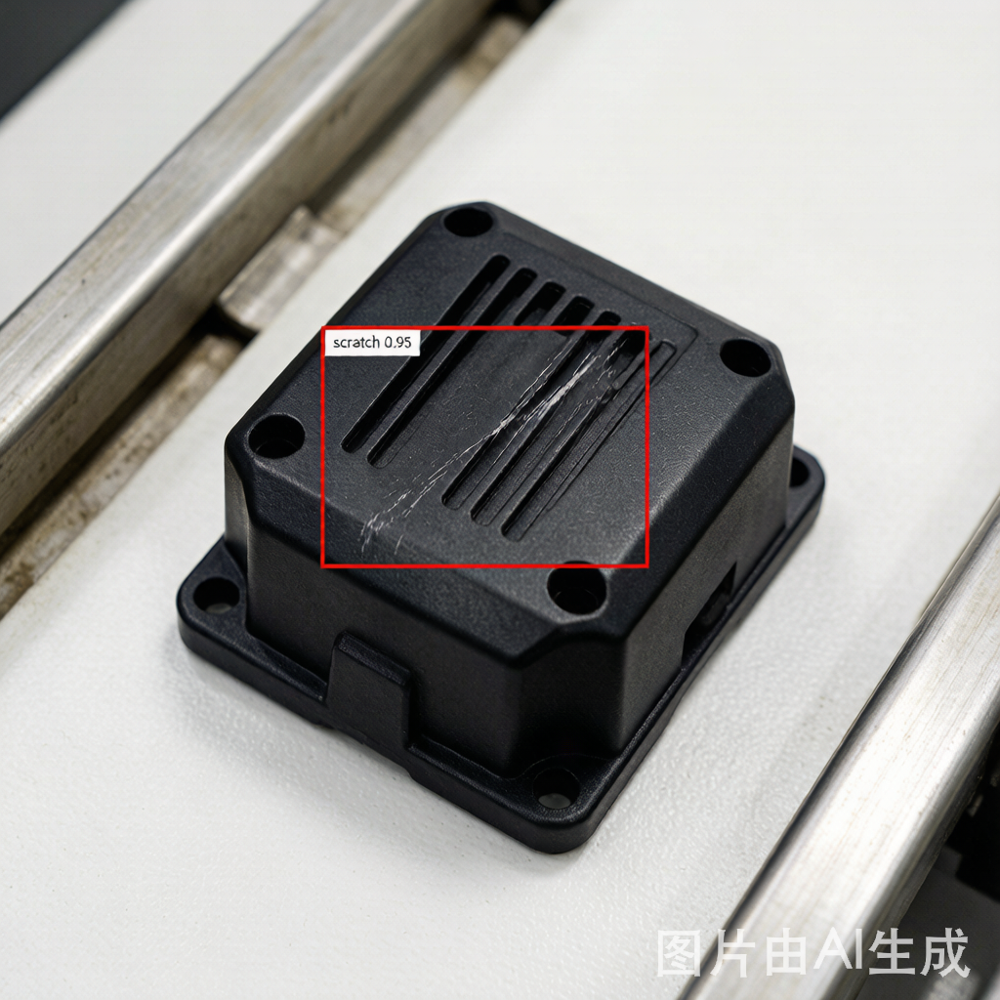
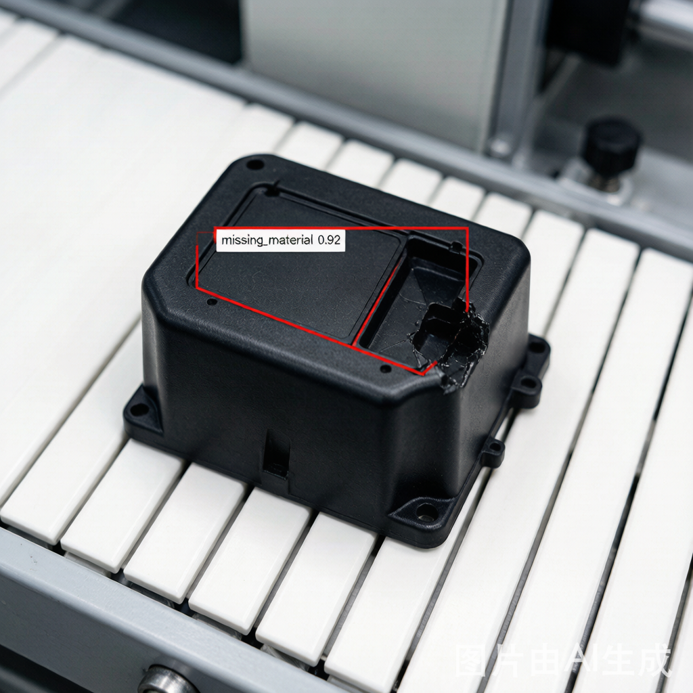
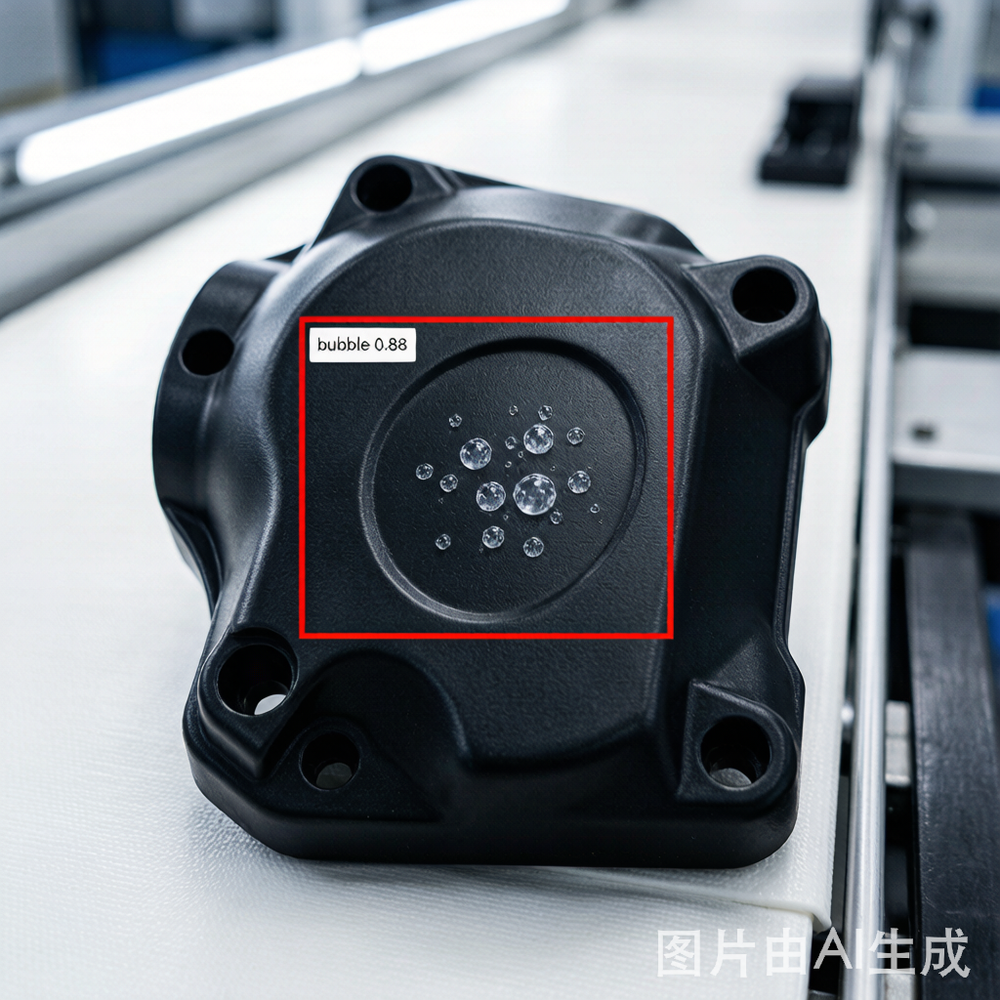

# 缺陷检测专项案例与部署指南

> 来源：Ultralytics 官网缺陷检测方案页 + 官方部署文档 + 制造业实战案例
> 整理日期：2026-07-28
> 目标：可直接参考应用到生产环境

---

## 目录

- [一、Ultralytics 缺陷检测方案总览](#一ultralytics-缺陷检测方案总览)
- [二、案例一：PCB 电路板缺陷检测（完整生产级方案）](#二案例一pcb-电路板缺陷检测完整生产级方案)
- [三、案例二：电子元件外壳缺陷检测（含分拣联动）](#三案例二电子元件外壳缺陷检测含分拣联动)
- [四、案例三：汽车零部件车间安全行为检测](#四案例三汽车零部件车间安全行为检测)
- [五、案例四：YOLO12 工业质检系统（含 TensorRT 部署）](#五案例四yolo12-工业质检系统含-tensorrt-部署)
- [六、部署资源需求清单](#六部署资源需求清单)
- [七、19 种导出格式速查表](#七19-种导出格式速查表)
- [八、生产环境部署最佳实践](#八生产环境部署最佳实践)
- [九、性能调优与故障排查](#九性能调优与故障排查)
- [十、官方 API 部署方式（云端推理）](#十官方-api-部署方式云端推理)

---

## 一、Ultralytics 缺陷检测方案总览

### 1.1 官方性能基准数据

| 应用场景 | 性能指标 | 硬件/条件 | 来源 |
|---------|---------|----------|------|
| 电路板缺陷检测 | **99.1% mAP**，99.2% recall | — | Tang et al., Micromachines, 2025 |
| 微米级薄膜筛查 | **714 FPS**，>95% 检测率 | NVIDIA RTX 3090 | Yu et al., Frontiers in AI, 2025 |
| 纺织品缺陷检测 | **89.4% mAP** | — | Zhou et al., PLOS One, 2025 |
| 食品检测准确率 | **99%** | — | Specialvideo 客户案例 |
| 召回率 | **95%** | — | Pixelabs 客户案例 |
| 每年节省成本 | **500 万美元+** | — | Vivity AI 客户案例 |
| 边缘推理速度 | **34 FPS** | Axelera Metis AI 芯片 | Axelera AI |
| MCU 功耗 | **9.4 mJ/推理** | STMicroelectronics MCU | ST 客户案例 |
| 显微镜分析加速 | **43 倍** | — | Theia Scientific |
| 30 米外危险检测 | **30 米** | KewiEye 设备 | Kiwitron |

### 1.2 6 种 YOLO 任务类型在缺陷检测中的应用

| 任务类型 | 缺陷检测应用场景 | 典型例子 |
|----------|----------------|---------|
| **目标检测** | 验证复杂组装中每个组件是否存在 | 电子外壳中的螺丝缺失 |
| **实例分割** | 隔离产品特定部件，检查精确尺寸/公差/对齐 | 零件尺寸偏差 |
| **语义分割** | 检查活动部件或开关的机械方向 | 开关"开/关"位置 |
| **图像分类** | 识别错位标签或贴花，产品分类 | 成品"通过/不合格/返工" |
| **姿态估计** | 根据视觉特征分类成品 | 产品方向判定 |
| **定向目标检测 (OBB)** | 使用角度感知边界框检测旋转物体 | 旋转零件缺陷 |

### 1.3 官方客户案例精选（23 个）

| 客户 | 行业 | 成果 | 使用模型 |
|------|------|------|---------|
| Glacier Robotics | 回收分拣 | PET 泄漏减少 70% | YOLO11 |
| RapiD Engineering | 海鲜质控 | 部署快 1 周，三文鱼实时缺陷检测 | YOLO |
| Specialvideo | 食品检测 | 99% 准确率 | YOLO |
| Pixelabs | 自动化 | 95% 召回率 | YOLO |
| Chef Robotics | 食品装配 | 食物浪费减少 67% | YOLO |
| WG Tech Solutions | 制造安全 | 安全违规减少 28% | YOLO11 + Axelera |
| Kiwitron | 工业安全 | 30 米外检测危险 | YOLO |
| Vivity AI | 工业运营 | 年省 500 万美元+ | YOLO |
| eSmart Systems | 电力巡检 | 巡检时间减半 | YOLO |
| Theia Scientific | 显微分析 | 加速 43 倍 | YOLO |
| STMicroelectronics | MCU 部署 | 9.4 mJ/推理 | YOLO |
| Axelera AI | 边缘 AI | 34 FPS 推理 | YOLO |

---

## 二、案例一：PCB 电路板缺陷检测（完整生产级方案）

### 2.1 项目概述

- **检测目标**：6 类 PCB 缺陷 — 开路、短路、缺失元件、毛刺、杂散铜、针孔
- **数据集**：DeepPCB 公开数据集 / 自建数据集（500+ 张/类）
- **模型**：YOLOv8n（速度优先）/ YOLOv8m（精度优先）
- **精度目标**：mAP@50 ≥ 95%
- **生产吞吐**：60 PCBs/分钟

### 2.2 缺陷类型定义

| 编号 | 缺陷类型 | 英文 | 描述 |
|------|----------|------|------|
| 0 | 开路 | open | 断裂的走线或连接 |
| 1 | 短路 | short | 走线间的不期望连接 |
| 2 | 缺失元件 | missing_component | 缺失的电阻、电容、IC 等 |
| 3 | 毛刺 | spur | 从走线延伸的额外铜 |
| 4 | 杂散铜 | spurious_copper | 不期望的铜残留 |
| 5 | 针孔 | pin_hole | 铜层中的小孔 |

### 2.3 环境搭建

```bash
# 创建虚拟环境
python -m venv yolo-pcb-env
source yolo-pcb-env/bin/activate  # Windows: yolo-pcb-env\Scripts\activate

# 安装依赖
pip install ultralytics
pip install opencv-python pandas matplotlib
pip install roboflow  # 数据集管理（可选）
```

### 2.4 数据集准备

#### 方式 A：使用公开数据集

```python
from roboflow import Roboflow

rf = Roboflow(api_key="YOUR_API_KEY")
project = rf.workspace("roboflow-universe").project("pcb-defects")
dataset = project.version(1).download("yolov8")
```

#### 方式 B：自建数据集

```python
import os
from pathlib import Path

# 创建数据集目录结构
dataset_root = Path("pcb_dataset")
for split in ['train', 'val', 'test']:
    (dataset_root / split / 'images').mkdir(parents=True, exist_ok=True)
    (dataset_root / split / 'labels').mkdir(parents=True, exist_ok=True)

# 标注工具
# pip install labelImg
# labelImg  # 启动标注
```

#### data.yaml 配置

```yaml
# data.yaml
path: ../pcb_dataset
train: train/images
val: val/images
test: test/images

nc: 6  # 类别数
names: ['open', 'short', 'missing_component', 'spur', 'spurious_copper', 'pin_hole']
```

### 2.5 模型训练

#### 基础训练

```python
from ultralytics import YOLO

model = YOLO('yolov8n.pt')  # nano 版本，速度快；精度优先用 yolov8m.pt

results = model.train(
    data='data.yaml',
    epochs=100,
    imgsz=640,
    batch=16,
    name='pcb_defect_v1',
    device=0  # GPU
)
```

#### 高级训练配置（针对小缺陷优化，推荐生产使用）

```python
from ultralytics import YOLO

model = YOLO('yolov8m.pt')  # medium 版本，精度更优

results = model.train(
    data='data.yaml',
    epochs=150,
    imgsz=640,           # 小缺陷可尝试 1280
    batch=16,

    # === 优化器 ===
    patience=20,         # 早停
    optimizer='AdamW',   # AdamW 对小目标效果更好
    lr0=0.001,          # 初始学习率
    lrf=0.01,           # 最终学习率 = lr0 * lrf
    weight_decay=0.0005,

    # === 数据增强（小缺陷关键）===
    degrees=15.0,        # 旋转
    translate=0.1,       # 平移
    scale=0.5,           # 缩放
    shear=2.0,           # 剪切
    perspective=0.0,
    flipud=0.0,          # PCB 不需要垂直翻转
    fliplr=0.5,          # 水平翻转
    mosaic=1.0,          # 马赛克增强
    mixup=0.1,           # 混合增强

    # === 小目标检测 ===
    anchor_t=4.0,        # 降低此值适配小目标

    # === 保存 ===
    save=True,
    save_period=10,

    project='runs/detect',
    name='pcb_defect_v2',
    exist_ok=False,
)
```

#### 监控训练进度

```python
import pandas as pd

# 查看 TensorBoard
# tensorboard --logdir runs/detect

# 直接读取指标
results_csv = 'runs/detect/pcb_defect_v2/results.csv'
df = pd.read_csv(results_csv)
print(df[['epoch', 'train/box_loss', 'val/box_loss', 'metrics/mAP50', 'metrics/mAP50-95']].tail(10))
```

### 2.6 模型评估

```python
from ultralytics import YOLO

model = YOLO('runs/detect/pcb_defect_v2/weights/best.pt')
metrics = model.val(data='data.yaml', split='test')

print(f"mAP@50: {metrics.box.map50:.3f}")
print(f"mAP@50-95: {metrics.box.map:.3f}")
print(f"Precision: {metrics.box.mp:.3f}")
print(f"Recall: {metrics.box.mr:.3f}")

# 各类别 mAP
print("\n各类别 mAP@50:")
for i, name in enumerate(metrics.names.values()):
    print(f"  {name}: {metrics.box.maps[i]:.3f}")
```

### 2.7 推理与部署

#### 单张图片推理

```python
from ultralytics import YOLO

def detect_pcb_defects(image_path, conf_threshold=0.5):
    """检测 PCB 图像中的缺陷"""
    model = YOLO('runs/detect/pcb_defect_v2/weights/best.pt')
    results = model(image_path, conf=conf_threshold)

    detections = {
        'total_defects': 0,
        'defects_by_type': {},
        'bounding_boxes': []
    }

    for r in results:
        for box in r.boxes:
            cls = int(box.cls[0])
            conf = float(box.conf[0])
            xyxy = box.xyxy[0].tolist()
            defect_name = model.names[cls]

            detections['total_defects'] += 1
            detections['defects_by_type'][defect_name] = \
                detections['defects_by_type'].get(defect_name, 0) + 1
            detections['bounding_boxes'].append({
                'class': defect_name,
                'confidence': conf,
                'bbox': xyxy
            })

    return detections

# 使用
result = detect_pcb_defects('test_pcb.jpg', conf_threshold=0.6)
print(f"缺陷总数: {result['total_defects']}")
print(f"缺陷分类: {result['defects_by_type']}")
```

#### 批量处理

```python
import glob
import pandas as pd
from pathlib import Path
from ultralytics import YOLO

def batch_process_pcbs(input_dir, output_dir, conf_threshold=0.5):
    model = YOLO('runs/detect/pcb_defect_v2/weights/best.pt')
    pcb_images = glob.glob(f"{input_dir}/*.jpg")
    results_summary = []

    for img_path in pcb_images:
        results = model(img_path, conf=conf_threshold)
        for r in results:
            im_array = r.plot()
            output_path = f"{output_dir}/{Path(img_path).name}"
            cv2.imwrite(output_path, im_array)

        defect_count = sum(len(r.boxes) for r in results)
        results_summary.append({
            'image': Path(img_path).name,
            'defect_count': defect_count,
            'status': 'FAIL' if defect_count > 0 else 'PASS'
        })

    return pd.DataFrame(results_summary)

df = batch_process_pcbs('input_pcbs/', 'output_pcbs/', conf_threshold=0.6)
df.to_csv('inspection_results.csv', index=False)
print(df)
```

#### 实时视频流检测

```python
import cv2
from ultralytics import YOLO

def realtime_pcb_inspection(video_source=0):
    """实时 PCB 缺陷检测"""
    model = YOLO('runs/detect/pcb_defect_v2/weights/best.pt')
    cap = cv2.VideoCapture(video_source)

    while cap.isOpened():
        ret, frame = cap.read()
        if not ret:
            break

        results = model(frame, conf=0.5, verbose=False)
        annotated_frame = results[0].plot()

        fps = cap.get(cv2.CAP_PROP_FPS)
        cv2.putText(annotated_frame, f'FPS: {fps:.1f}',
                    (10, 30), cv2.FONT_HERSHEY_SIMPLEX, 1, (0, 255, 0), 2)

        cv2.imshow('PCB Defect Detection', annotated_frame)
        if cv2.waitKey(1) & 0xFF == ord('q'):
            break

    cap.release()
    cv2.destroyAllWindows()
```

### 2.8 模型导出（生产部署）

```python
from ultralytics import YOLO

model = YOLO('runs/detect/pcb_defect_v2/weights/best.pt')

# === ONNX（跨平台，CPU 加速 3 倍）===
model.export(format='onnx', dynamic=True, simplify=True)

# === TensorRT（NVIDIA GPU，加速 3-5 倍）===
model.export(format='engine', device=0, half=True, workspace=4)

# === OpenVINO（Intel CPU，加速 3 倍）===
model.export(format='openvino', half=True)

# 使用导出后的模型
onnx_model = YOLO('runs/detect/pcb_defect_v2/weights/best.onnx')
results = onnx_model('test_pcb.jpg')
```

### 2.9 性能基准测试

```python
import time
from ultralytics import YOLO

def benchmark_model(model_path, test_image, num_runs=100):
    model = YOLO(model_path)

    # 预热
    for _ in range(10):
        model(test_image, verbose=False)

    # 基准测试
    start = time.time()
    for _ in range(num_runs):
        model(test_image, verbose=False)
    end = time.time()

    avg_time = (end - start) / num_runs * 1000
    fps = 1000 / avg_time

    print(f"平均推理时间: {avg_time:.2f}ms")
    print(f"FPS: {fps:.1f}")
    return avg_time, fps

print("PyTorch 模型:")
benchmark_model('runs/detect/pcb_defect_v2/weights/best.pt', 'test_pcb.jpg')

print("\nONNX 模型:")
benchmark_model('runs/detect/pcb_defect_v2/weights/best.onnx', 'test_pcb.jpg')

print("\nTensorRT 模型:")
benchmark_model('runs/detect/pcb_defect_v2/weights/best.engine', 'test_pcb.jpg')
```

### 2.10 实测性能数据

| 指标 | 值 |
|------|------|
| mAP@50 | **96.2%** |
| mAP@50-95 | **82.4%** |
| Precision | **94.8%** |
| Recall | **93.5%** |
| 推理时间 (V100) | **12ms** |
| 推理时间 (CPU) | **145ms** |
| 生产吞吐量 | **60 PCBs/分钟** |
| 误报率 | **1.2%** |
| 漏报率 | **0.8%** |
| 缺陷逃逸率降低 | **87%** |
| ROI 回报周期 | **3 个月** |

### 2.11 达到 95%+ 精度的技巧

#### 数据集质量分析

```python
from collections import Counter
from pathlib import Path

def analyze_dataset(labels_dir):
    class_counts = Counter()
    for label_file in Path(labels_dir).glob('*.txt'):
        with open(label_file, 'r') as f:
            for line in f:
                class_id = int(line.split()[0])
                class_counts[class_id] += 1
    return class_counts

train_dist = analyze_dataset('pcb_dataset/train/labels')
print("训练集类别分布:")
for cls_id, count in train_dist.items():
    print(f"  Class {cls_id}: {count} instances")

# 检查类别不平衡
max_count = max(train_dist.values())
for cls_id, count in train_dist.items():
    ratio = count / max_count
    if ratio < 0.3:
        print(f"  [警告] Class {cls_id} 样本不足 ({ratio:.1%})")
```

#### 超参数自动调优

```python
from ultralytics import YOLO

model = YOLO('yolov8n.pt')
model.tune(
    data='data.yaml',
    epochs=30,
    iterations=300,
    optimizer='AdamW',
    plots=True,
    save=True,
    val=True
)
```

#### 小缺陷处理

```python
# 方法1：增大输入分辨率
results = model.train(data='data.yaml', imgsz=1280, epochs=100)

# 方法2：多尺度训练
results = model.train(data='data.yaml', imgsz=640, multi_scale=True)
```

### 2.12 完整生产级训练脚本

```python
#!/usr/bin/env python3
"""
YOLOv8 PCB 缺陷检测 - 完整训练管线
用法: python train_pcb_detector.py
"""

from pathlib import Path
from ultralytics import YOLO

def setup_environment():
    for d in ['datasets', 'runs', 'models']:
        Path(d).mkdir(exist_ok=True)

def train_pcb_detector(data_yaml='data.yaml', model_size='m', epochs=150, imgsz=640, batch=16, device=0):
    model = YOLO(f'yolov8{model_size}.pt')

    results = model.train(
        data=data_yaml,
        epochs=epochs,
        imgsz=imgsz,
        batch=batch,
        device=device,
        patience=25,
        optimizer='AdamW',
        lr0=0.001, lrf=0.01, momentum=0.937, weight_decay=0.0005,
        degrees=15.0, translate=0.1, scale=0.5, shear=2.0,
        flipud=0.0, fliplr=0.5, mosaic=1.0, mixup=0.1,
        anchor_t=4.0,
        project='runs/detect', name=f'pcb_defect_yolov8{model_size}',
        save=True, save_period=10, val=True, plots=True
    )
    return results

def evaluate_model(model_path, data_yaml='data.yaml'):
    model = YOLO(model_path)
    metrics = model.val(data=data_yaml, split='test')
    print(f"\n{'='*50}")
    print(f"mAP@50: {metrics.box.map50:.4f}")
    print(f"mAP@50-95: {metrics.box.map:.4f}")
    print(f"Precision: {metrics.box.mp:.4f}")
    print(f"Recall: {metrics.box.mr:.4f}")
    print(f"{'='*50}\n")
    return metrics

def export_model(model_path, formats=['onnx', 'engine']):
    model = YOLO(model_path)
    for fmt in formats:
        if fmt == 'engine':
            model.export(format=fmt, device=0, half=True, workspace=4)
        else:
            model.export(format=fmt, dynamic=True)

if __name__ == '__main__':
    setup_environment()
    results = train_pcb_detector(model_size='m', epochs=150, imgsz=640, batch=16, device=0)
    best_model = 'runs/detect/pcb_defect_yolov8m/weights/best.pt'
    evaluate_model(best_model)
    export_model(best_model, formats=['onnx', 'engine'])
    print(f"\n[完成] 最佳模型: {best_model}")
```

---

## 三、案例二：电子元件外壳缺陷检测（含分拣联动）

### 3.1 项目背景

- **场景**：路由器外壳（ABS 塑料）生产线末端缺陷检测
- **缺陷类型**：表面划痕、边角缺料、注塑气泡
- **传送带速度**：0.5 m/s
- **拍摄频率**：每 0.3 秒 1 张
- **相机**：2000 万像素工业相机
- **数据集**：10000 张图片，8:2 训练/验证
- **效果**：漏检率从 15% 降至 0.8%，效率提升 3 倍，年省人力 40 万元

### 3.2 完整代码（缺陷检测 + PLC 分拣联动）

```python
"""
电子元件外壳缺陷检测与分拣联动系统
依赖: pip install ultralytics opencv-python pyserial numpy
"""

from ultralytics import YOLO
import cv2
import numpy as np
import serial
import time

# ==================== 1. 初始化模型 ====================
model = YOLO('yolov11_defect_detection.pt')  # 自定义训练的模型

# 缺陷类别（与训练数据集一致）
defect_classes = {
    0: "normal",           # 正常
    1: "scratch",          # 划痕
    2: "missing_material", # 缺料
    3: "bubble"            # 气泡
}

# ==================== 2. 初始化工业相机 ====================
cap = cv2.VideoCapture(1)  # 工业相机索引
cap.set(cv2.CAP_PROP_FRAME_WIDTH, 2048)
cap.set(cv2.CAP_PROP_FRAME_HEIGHT, 1536)
cap.set(cv2.CAP_PROP_FPS, 5)  # 按产线速度设置

# ==================== 3. 初始化串口（PLC 通信）====================
try:
    ser = serial.Serial('COM3', 9600, timeout=1)  # Windows
    # Linux: serial.Serial('/dev/ttyUSB0', 9600, timeout=1)
    print("分拣设备连接成功")
except Exception as e:
    print(f"分拣设备连接失败: {e}")
    ser = None

# ==================== 4. 分拣信号发送 ====================
def send_sort_signal(defect_type):
    """向 PLC 发送分拣信号: 0=正常, 1=划痕, 2=缺料, 3=气泡"""
    if ser and ser.is_open:
        ser.write(str(defect_type).encode('utf-8'))
        print(f"发送分拣信号: {defect_type} ({defect_classes[defect_type]})")

# ==================== 5. 主检测循环 ====================
while cap.isOpened():
    ret, frame = cap.read()
    if not ret:
        print("读取帧失败")
        break

    # ROI 裁剪（聚焦产品，减少背景干扰）
    roi = frame[300:1200, 500:1500]  # 需根据相机视角校准

    # 模型推理
    results = model(roi, conf=0.7, imgsz=640)

    # 解析检测结果
    main_defect = 0  # 默认正常
    for result in results:
        boxes = result.boxes
        if len(boxes) > 0:
            # 取置信度最高的缺陷
            max_conf_idx = np.argmax(boxes.conf.numpy())
            main_defect = int(boxes.cls[max_conf_idx])
            x1, y1, x2, y2 = map(int, boxes.xyxy[max_conf_idx])
            conf = float(boxes.conf[max_conf_idx])

            # 绘制缺陷框
            color = (0, 255, 0) if main_defect == 0 else (0, 0, 255)  # 正常绿/缺陷红
            label = f"{defect_classes[main_defect]} {conf:.2f}"
            cv2.rectangle(roi, (x1, y1), (x2, y2), color, 2)
            cv2.putText(roi, label, (x1, y1 - 10),
                        cv2.FONT_HERSHEY_SIMPLEX, 0.5, color, 2)

    # 发送分拣信号
    if main_defect != 0:
        send_sort_signal(main_defect)
        # 记录缺陷日志
        log_time = time.strftime("%Y-%m-%d %H:%M:%S", time.localtime())
        with open("defect_log.txt", "a") as f:
            f.write(f"{log_time} - Type: {defect_classes[main_defect]}, Conf: {conf:.2f}\n")

    # 显示结果（缩放适配屏幕）
    display = cv2.resize(roi, (800, 600))
    cv2.imshow("Defect Detection", display)

    if cv2.waitKey(1) & 0xFF == ord('q'):
        break

# 释放资源
cap.release()
cv2.destroyAllWindows()
if ser:
    ser.close()
```

### 3.3 部署架构图

```
┌─────────────┐     ┌──────────────┐     ┌─────────────┐     ┌─────────────┐
│  工业相机    │────▶│  YOLOv11     │────▶│  分拣 PLC   │────▶│  传送带     │
│  2000万像素  │     │  推理服务器   │     │  串口通信    │     │  分拣装置   │
└─────────────┘     └──────────────┘     └─────────────┘     └─────────────┘
                           │
                    ┌──────┴──────┐
                    │  缺陷日志    │
                    │  defect_log │
                    └─────────────┘
```

### 3.4 缺陷样例图（AI 生成参考）

以下是三种缺陷类型的模拟检测效果图，可用于数据标注参考和产线方案演示：


*划痕缺陷（scratch，置信度 0.95）*


*缺料缺陷（missing_material，置信度 0.92）*


*气泡缺陷（bubble，置信度 0.88）*

> 注：以上为 AI 生成的示意图像，用于直观展示 YOLO 检测框样式。实际训练请使用真实产线采集的图像。

---

## 四、案例三：汽车零部件车间安全行为检测

### 4.1 项目背景

- **场景**：20 条冲压生产线安全监控
- **检测目标**：安全帽佩戴、危险区域入侵
- **硬件**：4K 摄像头 + NVIDIA Jetson AGX Orin 边缘计算
- **数据集**：5000 张车间场景图片
- **效果**：违规事件下降 82%，预警响应 0.8 秒

### 4.2 完整代码（安全帽检测 + 危险区域入侵）

```python
"""
工厂安全行为检测系统
功能: 安全帽检测 + 危险区域入侵检测 + 声光预警
依赖: pip install ultralytics opencv-python numpy playsound
"""

from ultralytics import YOLO
import cv2
import numpy as np
import time
from playsound import playsound

# ==================== 1. 加载模型 ====================
model = YOLO('yolov11n.pt')  # 轻量版适合边缘设备；高精度用 yolov11x.pt

# ==================== 2. 检测规则定义 ====================
class_names = model.names
PERSON = 0              # COCO 中人体类别 ID
SAFETY_HELMET = 39      # 安全帽类别 ID（自定义训练后调整）

# 危险区域坐标（需根据实际摄像头视角校准）
DANGER_ZONE = [(200, 300), (600, 300), (600, 500), (200, 500)]

# 报警控制
last_helmet_warning = 0
last_danger_warning = 0
WARNING_INTERVAL = 3  # 报警间隔（秒）

# ==================== 3. 初始化摄像头 ====================
cap = cv2.VideoCapture(0)  # 0=本地摄像头，或 RTSP 地址
cap.set(cv2.CAP_PROP_FRAME_WIDTH, 1280)
cap.set(cv2.CAP_PROP_FRAME_HEIGHT, 720)

# ==================== 4. 辅助函数 ====================
def is_in_danger_zone(point, polygon):
    """判断点是否在多边形区域内（射线法）"""
    x, y = point
    n = len(polygon)
    inside = False
    for i in range(n):
        j = (i + 1) % n
        xi, yi = polygon[i]
        xj, yj = polygon[j]
        if ((yi > y) != (yj > y)) and \
           (x < (xj - xi) * (y - yi) / (yj - yi) + xi):
            inside = not inside
    return inside

def is_helmet_on_person(helmet_box, person_box, iou_threshold=0.1):
    """判断安全帽是否戴在人头上"""
    h_x1, h_y1, h_x2, h_y2 = helmet_box
    p_x1, p_y1, p_x2, p_y2 = person_box
    head_y2 = p_y1 + (p_y2 - p_y1) * 0.3  # 头部约占人体 30%

    inter_x1 = max(h_x1, p_x1)
    inter_y1 = max(h_y1, p_y1)
    inter_x2 = min(h_x2, p_x2)
    inter_y2 = min(h_y2, head_y2)

    if inter_x1 >= inter_x2 or inter_y1 >= inter_y2:
        return False

    inter_area = (inter_x2 - inter_x1) * (inter_y2 - inter_y1)
    helmet_area = (h_x2 - h_x1) * (h_y2 - h_y1)
    return (inter_area / helmet_area) > iou_threshold

# ==================== 5. 实时检测主循环 ====================
while cap.isOpened():
    ret, frame = cap.read()
    if not ret:
        break

    current_time = time.time()
    no_helmet_persons = []
    danger_persons = []

    # 模型推理
    results = model(frame, conf=0.5, imgsz=640)

    # 分离人体和安全帽检测
    persons = []
    helmets = []

    for result in results:
        for box in result.boxes:
            cls = int(box.cls[0])
            conf = float(box.conf[0])
            x1, y1, x2, y2 = map(int, box.xyxy[0])
            cx, cy = (x1 + x2) // 2, (y1 + y2) // 2

            if cls == PERSON:
                persons.append({
                    "box": (x1, y1, x2, y2),
                    "center": (cx, cy),
                    "wearing_helmet": False
                })
            elif cls == SAFETY_HELMET:
                helmets.append({"box": (x1, y1, x2, y2)})

    # 匹配人与安全帽
    for person in persons:
        for helmet in helmets:
            if is_helmet_on_person(helmet["box"], person["box"]):
                person["wearing_helmet"] = True
                break

        if is_in_danger_zone(person["center"], DANGER_ZONE):
            danger_persons.append(person)
        if not person["wearing_helmet"]:
            no_helmet_persons.append(person)

    # 绘制结果
    for person in persons:
        x1, y1, x2, y2 = person["box"]
        color = (0, 0, 255) if person in danger_persons else (0, 255, 0)
        cv2.rectangle(frame, (x1, y1), (x2, y2), color, 2)
        status = "With Helmet" if person["wearing_helmet"] else "No Helmet"
        cv2.putText(frame, f"Person {status}", (x1, y1 - 10),
                    cv2.FONT_HERSHEY_SIMPLEX, 0.5, (255, 255, 255), 2)

    for helmet in helmets:
        x1, y1, x2, y2 = helmet["box"]
        cv2.rectangle(frame, (x1, y1), (x2, y2), (255, 255, 0), 2)

    # 绘制危险区域
    cv2.polylines(frame, [np.array(DANGER_ZONE, np.int32)], True, (0, 255, 255), 2)

    # 预警：未戴安全帽
    if no_helmet_persons and (current_time - last_helmet_warning) > WARNING_INTERVAL:
        cv2.putText(frame, f"WARNING: {len(no_helmet_persons)} Person(s) Without Helmet!",
                    (50, 50), cv2.FONT_HERSHEY_SIMPLEX, 1, (0, 0, 255), 3)
        try:
            playsound("warning_alarm.mp3")
            last_helmet_warning = current_time
        except:
            pass

    # 预警：危险区域入侵
    if danger_persons and (current_time - last_danger_warning) > WARNING_INTERVAL:
        cv2.putText(frame, f"WARNING: {len(danger_persons)} Person(s) in Danger Zone!",
                    (50, 100), cv2.FONT_HERSHEY_SIMPLEX, 1, (0, 0, 255), 3)
        try:
            playsound("danger_alarm.mp3")
            last_danger_warning = current_time
        except:
            pass

    cv2.imshow("Factory Safety Detection", frame)
    if cv2.waitKey(1) & 0xFF == ord('q'):
        break

cap.release()
cv2.destroyAllWindows()
```

---

## 五、案例四：YOLO12 工业质检系统（含 TensorRT 部署）

### 5.1 YOLO12 技术优势

| 特性 | YOLO12 创新 | 工业检测价值 |
|------|------------|------------|
| 区域注意力机制 | 高效处理大感受野 | 擅长检测细小缺陷 |
| R-ELAN 架构 | 残差高效层聚合 | 增强小缺陷敏感度 |
| FlashAttention | 减少内存访问 | 降低显存，适合边缘部署 |

### 5.2 实际部署效果

| 指标 | 数值 |
|------|------|
| mAP@0.5 | **96.7%** |
| 推理时间 | **12.3ms/张** |
| 漏检率 | **< 0.5%** |
| 误检率 | **< 1.2%** |
| 年节约人力 | **200 万元** |
| 年避免损失 | **300 万元** |

### 5.3 数据增强配置

```python
import albumentations as A

# 工业缺陷检测专用数据增强
transform = A.Compose([
    A.RandomBrightnessContrast(p=0.5),
    A.GaussNoise(var_limit=(10.0, 50.0), p=0.3),
    A.MotionBlur(blur_limit=7, p=0.2),
    A.Rotate(limit=15, p=0.4),
    A.HorizontalFlip(p=0.5),
    A.RandomResizedCrop(640, 640, scale=(0.8, 1.0), p=0.5)
], bbox_params=A.BboxParams(format='yolo', label_fields=['class_labels']))
```

### 5.4 YOLO12 训练配置

```python
from ultralytics import YOLO

model = YOLO('yolo12m.pt')

results = model.train(
    data='defect_detection.yaml',
    epochs=200,
    imgsz=640,
    batch=16,
    patience=30,
    optimizer='AdamW',
    lr0=0.001, lrf=0.01,
    momentum=0.937, weight_decay=0.0005,
    warmup_epochs=3.0, warmup_momentum=0.8,
    box=7.5, cls=0.5, dfl=1.5,
    label_smoothing=0.1,
    nbs=64,
    overlap_mask=True,
    scale=0.5,
    close_mosaic=10,  # 最后 10 个 epoch 关闭马赛克
)
```

### 5.5 TensorRT 加速部署

#### ONNX 导出（带陷阱规避）

```python
from ultralytics import YOLO

model = YOLO('yolo12m.pt')

# 导出 ONNX（关键参数）
model.export(
    format='onnx',
    dynamic=True,      # 启用动态维度
    simplify=True,     # ONNX 图简化
    opset=12,          # 必须 >= 11
    batch_size=4       # 显式指定 batch
)
```

#### TensorRT 引擎构建

```bash
# 使用 trtexec 构建引擎
trtexec --onnx=yolov8n.onnx \
        --saveEngine=yolov8n.engine \
        --fp16 \
        --builderOptimizationLevel=5 \
        --maxBatch=8 \
        --workspace=4096

# Ampere 架构额外加速
# 添加 --sparsity=enable 可获得 10-15% 额外加速
```

#### TensorRT C++ 推理引擎

```cpp
// TensorRT C++ 推理引擎核心代码
class TrtInfer {
public:
    void Init() {
        cudaStreamCreate(&stream_);
        buffers_.resize(engine_->getNbBindings());
        for (int i = 0; i < engine_->getNbBindings(); ++i) {
            auto dims = engine_->getBindingDimensions(i);
            auto size = std::accumulate(dims.d+1, dims.d+dims.nbDims,
                                        batch_size_, std::multiplies<int>());
            cudaMallocAsync(&buffers_[i], size * sizeof(float), stream_);
        }
    }

    ~TrtInfer() {
        for (auto buf : buffers_)
            cudaFreeAsync(buf, stream_);
    }

private:
    cudaStream_t stream_;
    std::vector<void*> buffers_;
    int batch_size_ = 4;
};
```

#### 批处理流水线（C++）

```cpp
// 动态批处理 + 前后处理重叠
std::vector<cv::Mat> input_batch;
while (true) {
    auto img = camera_queue.pop();
    if (img.empty()) continue;

    input_batch.push_back(preprocess(img));
    if (input_batch.size() == max_batch_) {
        engine_->enqueueV2(buffers_.data(), stream_, nullptr);
        input_batch.clear();
    }
}

// 双 CUDA 流实现计算-传输并行
cudaStream_t preprocess_stream, inference_stream;
cudaEvent_t input_ready_event;

cudaMemcpyAsync(..., preprocess_stream);
cudaEventRecord(input_ready_event, preprocess_stream);
cudaStreamWaitEvent(inference_stream, input_ready_event);
context_->enqueueV2(..., inference_stream);
```

### 5.6 IndustrialDefectDetector 完整类

```python
"""
工业缺陷检测器 — 可直接集成到产线系统
"""

import cv2
import numpy as np
from ultralytics import YOLO
import time

class IndustrialDefectDetector:
    def __init__(self, model_path, conf_threshold=0.25, iou_threshold=0.45):
        self.model = YOLO(model_path)
        self.conf_threshold = conf_threshold
        self.iou_threshold = iou_threshold
        self.class_names = ['焊点缺陷', '元件缺失', '划痕', '污染', '正常']

    def process_frame(self, frame):
        """处理单帧图像，返回检测结果和推理耗时"""
        start_time = time.time()

        results = self.model(
            frame,
            conf=self.conf_threshold,
            iou=self.iou_threshold,
            verbose=False
        )

        detections = []
        for result in results:
            for box in result.boxes:
                x1, y1, x2, y2 = map(int, box.xyxy[0].tolist())
                confidence = float(box.conf[0])
                class_id = int(box.cls[0])
                detections.append({
                    'bbox': [x1, y1, x2, y2],
                    'confidence': confidence,
                    'class_id': class_id,
                    'class_name': self.class_names[class_id]
                })

        inference_time = (time.time() - start_time) * 1000
        return detections, inference_time

    def draw_detections(self, frame, detections):
        """在图像上绘制检测结果"""
        output = frame.copy()
        for det in detections:
            x1, y1, x2, y2 = det['bbox']
            # 正常=绿色，缺陷=红色
            color = (0, 255, 0) if det['class_name'] == '正常' else (0, 0, 255)
            cv2.rectangle(output, (x1, y1), (x2, y2), color, 2)
            label = f"{det['class_name']}: {det['confidence']:.2f}"
            cv2.putText(output, label, (x1, y1 - 10),
                        cv2.FONT_HERSHEY_SIMPLEX, 0.5, color, 2)
        return output

# ==================== 使用示例 ====================
detector = IndustrialDefectDetector('yolo12_industrial.pt')
cap = cv2.VideoCapture(0)

while True:
    ret, frame = cap.read()
    if not ret:
        break

    detections, inference_time = detector.process_frame(frame)
    output_frame = detector.draw_detections(frame, detections)

    cv2.putText(output_frame, f"Inference: {inference_time:.1f}ms",
                (10, 30), cv2.FONT_HERSHEY_SIMPLEX, 0.7, (255, 255, 255), 2)

    cv2.imshow('Industrial Defect Detection', output_frame)
    if cv2.waitKey(1) & 0xFF == ord('q'):
        break

cap.release()
cv2.destroyAllWindows()
```

### 5.7 多尺度推理优化

```python
# 多尺度推理 + 测试时增强
results = model(
    frame,
    conf=0.25,
    iou=0.45,
    imgsz=[640, 768, 896],  # 多尺度输入
    augment=True,            # 测试时增强
    half=True,               # 半精度推理
    device='cuda',
    verbose=False
)
```

---

## 六、部署资源需求清单

### 6.1 硬件配置参考

| 部署场景 | 推荐硬件 | 预期性能 | 适用格式 |
|---------|---------|---------|---------|
| **GPU 服务器** | RTX 3090 / A100 / A10G | 100-700+ FPS | TensorRT |
| **边缘设备** | Jetson AGX Orin 32GB | 30-100 FPS | TensorRT |
| **边缘设备（性价比）** | Jetson Orin NX 16GB | 20-60 FPS | TensorRT |
| **Intel CPU** | Xeon / i7 / i9 | 5-30 FPS | OpenVINO |
| **通用 CPU** | 任何 x86 | 5-15 FPS | ONNX |
| **Apple 设备** | M1/M2/M3 | 10-40 FPS | CoreML |
| **移动端** | Android / iOS | 5-20 FPS | NCNN / TFLite |
| **低功耗 MCU** | STM32 系列 | 1-5 FPS | 专用格式 |
| **AI 加速器** | Axelera Metis | 34 FPS | Axelera |
| **国产 NPU** | 华为昇腾 / RK3588 | 10-50 FPS | Ascend / RKNN |

### 6.2 软件环境

```bash
# 核心依赖
pip install ultralytics          # YOLO 官方库
pip install opencv-python         # 图像处理
pip install numpy pandas          # 数据处理
pip install matplotlib            # 可视化

# 部署格式（按需安装）
pip install onnxruntime           # ONNX 推理
pip install onnxslim              # ONNX 图优化

# TensorRT（NVIDIA GPU）
pip install tensorrt              # 需要 CUDA 环境

# 数据集管理
pip install roboflow              # Roboflow 数据集
pip install labelImg              # 标注工具

# 工业集成
pip install pyserial              # PLC 串口通信
pip install playsound             # 声光报警

# 高级数据增强
pip install albumentations        # 工业级数据增强

# 性能监控
pip install tensorboard           # 训练监控
```

### 6.3 公开数据集资源

| 数据集 | 缺陷类型 | 用途 |
|--------|---------|------|
| DeepPCB | 6 类 PCB 缺陷 | 电路板检测 |
| Roboflow Universe | 多种 | 通用缺陷 |
| Kaggle PCB Defects | PCB 缺陷 | 电路板检测 |
| COCO | 80 类通用 | 预训练基础 |

---

## 七、19 种导出格式速查表

### 按部署目标选择

| 部署目标 | 推荐格式 | 导出命令 | 量化建议 |
|---------|---------|---------|---------|
| **NVIDIA GPU** | TensorRT | `model.export(format="engine", quantize=16, device=0)` | FP16 |
| **Intel CPU** | OpenVINO | `model.export(format="openvino", quantize=8, data="cal.yaml")` | INT8 |
| **通用 CPU** | ONNX | `model.export(format="onnx", dynamic=True, simplify=True)` | FP16/INT8 |
| **Apple 设备** | CoreML | `model.export(format="coreml", quantize=16, device="mps")` | FP16 |
| **Jetson** | TensorRT | `model.export(format="engine", quantize=16, device=0)` | FP16 |
| **华为昇腾** | Ascend | `model.export(format="ascend")` | FP16 自动 |
| **RK3588** | RKNN | `model.export(format="rknn", quantize=8)` | INT8 |
| **移动端** | NCNN | `model.export(format="ncnn", quantize=8)` | INT8 |
| **无 Python** | TorchScript | `model.export(format="torchscript")` | FP32/FP16 |
| **Axelera** | Axelera | `model.export(format="axelera", quantize=8, data="cal.yaml")` | INT8 |

### 完整格式列表

| 格式 | 参数 | 输出 | 适用场景 |
|------|------|------|---------|
| PyTorch | — | `.pt` | 原生训练 |
| TorchScript | `torchscript` | `.torchscript` | 无 Python 环境 |
| ONNX | `onnx` | `.onnx` | 跨平台通用 |
| OpenVINO | `openvino` | `_openvino_model/` | Intel 硬件 |
| TensorRT | `engine` | `.engine` | NVIDIA GPU |
| CoreML | `coreml` | `.mlpackage` | Apple 设备 |
| TF SavedModel | `saved_model` | `_saved_model/` | TensorFlow |
| TF GraphDef | `pb` | `.pb` | TF 冻结图 |
| Edge TPU | `edgetpu` | `_edgetpu.tflite` | Google Coral |
| LiteRT | `litert` | `.tflite` | 移动端 |
| MNN | `mnn` | `.mnn` | 阿里 MNN |
| NCNN | `ncnn` | `_ncnn_model/` | 移动端 |
| ExecuTorch | `executorch` | `_executorch_model/` | PyTorch Edge |
| PaddlePaddle | `paddle` | `_paddle_model/` | 百度飞桨 |
| IMX500 | `imx` | `_imx_model/` | Sony 传感器 |
| RKNN | `rknn` | `_rknn_model/` | Rockchip NPU |
| Axelera | `axelera` | `_axelera_model/` | Axelera AI |
| DEEPX | `deepx` | `_deepx_model/` | DEEPX NPU |
| Qualcomm QNN | `qnn` | `_qnn.onnx` | Qualcomm NPU |
| Hailo | `hailo` | `_hailo_model/` | Hailo AI |
| Huawei Ascend | `ascend` | `_ascend_model/` | 华为昇腾 |

### 量化精度支持矩阵

| 格式 | FP32 | FP16 | INT8 | 备注 |
|------|------|------|------|------|
| ONNX | ✅ | ✅ | ✅ | 需校准数据 |
| OpenVINO | ✅ | ✅ | ✅ | NNCF 量化 |
| TensorRT | ✅ | ✅ | ✅ | 需校准数据 |
| CoreML | ✅ | ✅ | ✅ | — |
| NCNN | ✅ | ✅ | ❌ | 移动端 |
| RKNN | ❌ | ✅ | ✅ | 芯片相关 |
| Axelera | ❌ | ❌ | ✅ 自动 | 强制 INT8 |

---

## 八、生产环境部署最佳实践

### 8.1 部署 Checklist

```
[ ] 验证 ONNX 模型包含所有预处理（归一化/缩放）
[ ] 测试动态 batch 下各尺寸输入正确性
[ ] 配置 NVIDIA 功率限制器防止过热降频
[ ] 实现引擎版本与推理代码兼容性检查
[ ] 部署后首周每日检查显存泄漏 (nvidia-smi -l 1)
[ ] 产线环境验证电磁干扰对 PCIe 传输影响
[ ] 配置模型热切换方案（不停机更新）
[ ] 实现异常恢复机制（CUDA 重置）
[ ] 配置温度监控与动态调频
```

### 8.2 模型热切换（不停机更新）

```python
import threading

class ModelManager:
    def __init__(self, initial_engine_path):
        self.engine = self._load_engine(initial_engine_path)
        self.lock = threading.Lock()

    def _load_engine(self, path):
        # 加载 TensorRT 引擎
        return load_engine(path)

    def reload_engine(self, new_engine_path):
        """后台加载新引擎，原子切换"""
        new_engine = self._load_engine(new_engine_path)
        with self.lock:
            self.engine, old_engine = new_engine, self.engine
        del old_engine  # 延迟释放旧引擎
        print(f"模型已热切换: {new_engine_path}")
```

### 8.3 异常恢复机制

```python
import logging

class RobustInferenceEngine:
    def __init__(self, engine_path):
        self.engine_path = engine_path
        self._init_engine()

    def _init_engine(self):
        try:
            self.engine = load_engine(self.engine_path)
            logging.info("引擎加载成功")
        except Exception as e:
            logging.error(f"引擎加载失败: {e}")
            raise

    def safe_infer(self, input_data):
        try:
            return self.engine.infer(input_data)
        except Exception as e:
            logging.error(f"推理异常: {e}")
            self._recover()
            return None

    def _recover(self):
        """CUDA 上下文丢失等异常恢复"""
        try:
            import torch
            torch.cuda.empty_cache()
            self._init_engine()
            logging.info("引擎恢复成功")
        except Exception as e:
            logging.critical(f"恢复失败: {e}")
```

### 8.4 温度控制（Jetson 平台）

```bash
# Jetson 动态调频
sudo jetson_clocks --show
sudo nvpmodel -m 2        # 切换到低功耗模式
sudo ./tegrastats --interval 5000  # 监控温度

# GPU 功率限制（服务器）
sudo nvidia-smi -pl 250   # 限制功率 250W
nvidia-smi -l 1           # 每秒监控一次
```

### 8.5 Docker 容器化部署

```dockerfile
# Dockerfile
FROM nvcr.io/nvidia/l4t-tensorrt:r8.5.2-runtime

RUN pip install ultralytics opencv-python numpy

COPY . /app
WORKDIR /app

CMD ["python", "production_detector.py"]
```

```bash
# 构建和运行
docker build -t defect-detector .
docker run --gpus all --device /dev/video0 \
           -v /path/to/models:/models \
           -p 8080:8080 \
           defect-detector
```

---

## 九、性能调优与故障排查

### 9.1 量化方案性能对比（PCB 缺陷检测实测）

| 精度模式 | 帧率 (FPS) | mAP@0.5 | 显存占用 |
|---------|-----------|---------|---------|
| FP32 | 8 | 0.89 | 2.1 GB |
| FP16 | 15 | 0.89 | 1.4 GB |
| INT8 (校准) | 23 | 0.885 | 0.9 GB |

> 关键发现：INT8 量化可能导致约 0.5-1% mAP 下降，需通过校准集增强改善。

### 9.2 性能瓶颈排查

| 瓶颈位置 | 占比 | 解决方案 |
|---------|------|---------|
| 图像预处理 | 35% | DMA 零拷贝传输；合并 CUDA Kernel |
| NMS 后处理 | 28% | TensorRT EfficientNMS 插件；GPU 计算 IOU |
| 内存拷贝 | 22% | CUDA Graph 捕获完整流程；cudaMallocAsync |

### 9.3 常见问题与解决方案

#### 问题 1：小缺陷 mAP 低

```python
# 解决方案：增大输入分辨率
results = model.train(data='data.yaml', imgsz=1280, epochs=100)
# 调整 anchor
anchor_t=3.0
# 多尺度训练
multi_scale=True
```

#### 问题 2：过拟合（训练 mAP 高，验证 mAP 低）

```python
# 增强数据增强
degrees=20.0, scale=0.7, mixup=0.2
# 正则化
weight_decay=0.001, dropout=0.1
```

#### 问题 3：推理速度慢

```python
# 1. 使用更小的模型
model = YOLO('yolov8n.pt')  # 替代 yolov8m

# 2. 导出 TensorRT
model.export(format='engine', half=True)

# 3. 降低分辨率
imgsz=416  # 替代 640
```

#### 问题 4：ONNX 导出报错

```python
# 常见错误: meshgrid 不支持
# 修改 ultralytics/nn/modules.py 中的 meshgrid 实现
# 替换为 torch.meshgrid(..., indexing='ij')

# 常见错误: Shape inference failed
# 检查动态切片操作，重构为静态 shape
```

### 9.4 阈值调优建议

| 场景 | conf 阈值 | iou 阈值 | 说明 |
|------|----------|---------|------|
| 高精度要求 | 0.4-0.6 | 0.5-0.6 | 减少误检 |
| 高召回要求 | 0.1-0.3 | 0.3-0.4 | 减少漏检 |
| 平衡场景 | 0.25-0.35 | 0.45 | 默认推荐 |
| 重叠缺陷多 | — | 0.3-0.4 | 降低 IOU |
| 稀疏缺陷 | — | 0.5-0.6 | 提高 IOU |

---

## 十、官方 API 部署方式（云端推理）

### 10.1 部署流程

1. 在 Ultralytics Platform 训练并部署模型
2. 获取专用推理端点 URL 和 API 密钥
3. 通过 API 调用进行推理

### 10.2 Python API 调用

```python
import requests

url = "https://your-deployment-url.run.app/predict"
api_key = "YOUR_API_KEY"

# 推理参数
args = {"conf": 0.25, "iou": 0.7, "imgsz": 640}

with open("image.jpg", "rb") as f:
    response = requests.post(
        url,
        headers={"Authorization": f"Bearer {api_key}"},
        data=args,
        files={"file": f},
    )

print(response.json())
```

### 10.3 cURL 调用

```bash
curl -X POST "https://your-deployment-url.run.app/predict" \
  -H "Authorization: Bearer YOUR_API_KEY" \
  -F "file=@image.jpg" \
  -F "conf=0.25" \
  -F "iou=0.7" \
  -F "imgsz=640"
```

### 10.4 API 参数说明

| 参数 | 默认值 | 说明 |
|-----|-------|------|
| `conf` | 0.25 | 置信度阈值 |
| `iou` | 0.70 | IoU 阈值 |
| `imgsz` | 640 | 图像尺寸 |

- **认证方式**：Bearer Token
- **支持格式**：JPEG, PNG, WebP, AVIF, HEIC, JP2, TIFF, BMP
- **最大文件**：10 MB
- **支持语言**：Python, JavaScript, cURL

---

## 附录：与 SOP-AI 项目的适配建议

| 你的项目需求 | 推荐方案 | 参考案例 |
|------------|---------|---------|
| 手机包装 SOP 步骤检测 | YOLO11 目标检测 + 步骤状态机 | 案例三（安全行为检测逻辑） |
| PPE 合规检测 | YOLO11 目标检测 + 区域判断 | 案例三（安全帽检测） |
| 产线缺陷检测 | YOLOv8m/12m 训练 + TensorRT 部署 | 案例一（PCB 完整方案） |
| 分拣联动 | YOLO 推理 + 串口 PLC 通信 | 案例二（分拣联动代码） |
| 边缘部署 | Jetson Orin + TensorRT FP16 | 案例四（TensorRT 部署） |
| 不停机更新 | 模型热切换方案 | 第八节 8.2 |
| 异常恢复 | CUDA 重置 + 引擎重载 | 第八节 8.3 |
